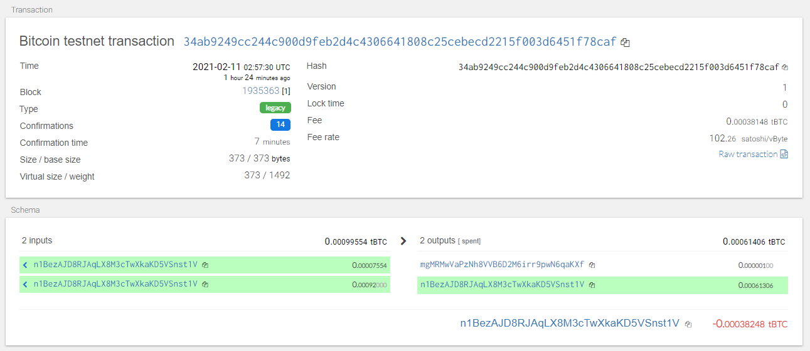
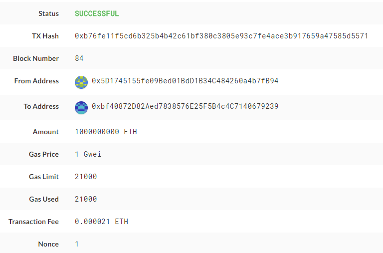

# Multi-Blockchain-Wallet-in-Python

Open up a new terminal window inside of `wallet`,
then run `python`. Within the Python shell, run `from wallet import *` -- you can now access the functions interactively.
You'll need to set the account with  `priv_key_to_account` and use `send_txn` to send transactions

- Pick ETH or BTCTEST for coin
- get priv key by calling `coins[COINTYPE][INDEX]['privkey']`

```python
def priv_key_to_account(coin, priv_key):

    if(coin == 'eth'):
        return Account.privateKeyToAccount(priv_key)
    elif(coin == 'btc-test'):
        return PrivateKeyTestnet(priv_key)

```

`account = priv_key_to_account(BTCTEST, coins[BTCTEST][0]['privkey])`

```python
def send_txn(coin, account, to, amount):
    raw_tx = create_tx(coin, account, to, amount)
    signed = account.sign_transaction(raw_tx)
    if(coin == 'eth'):
        return w3.eth.sendRawTransaction(signed.rawTransaction)
    elif(coin == 'btc-test'):
        return NetworkAPI.broadcast_tx_testnet(signed)
```

`send_txn(BTCTEST,account,'RecipentAddress',0.00001)`



`account = priv_key_to_account(ETH, coins[ETH][0]['privkey])`
`send_txn(ETH,account,'RecipentAddress',100000000)`

